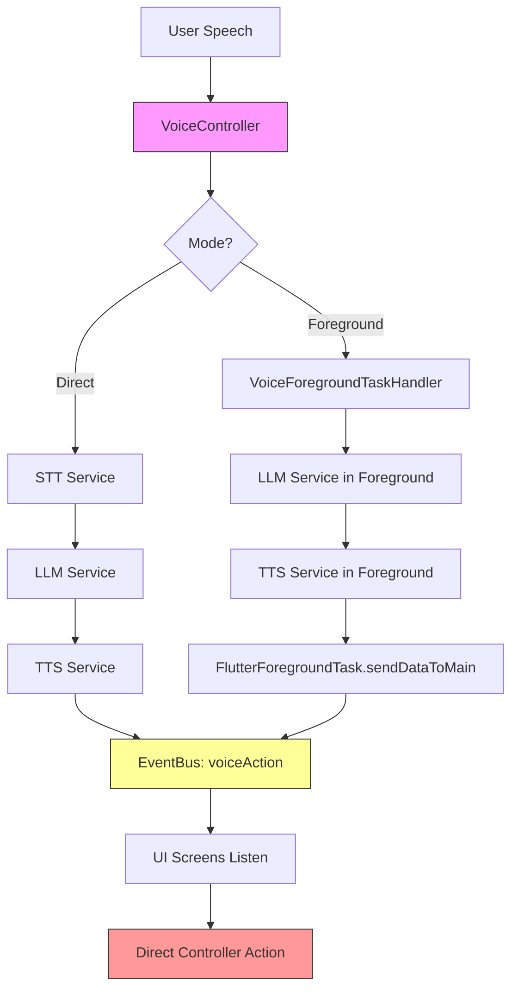
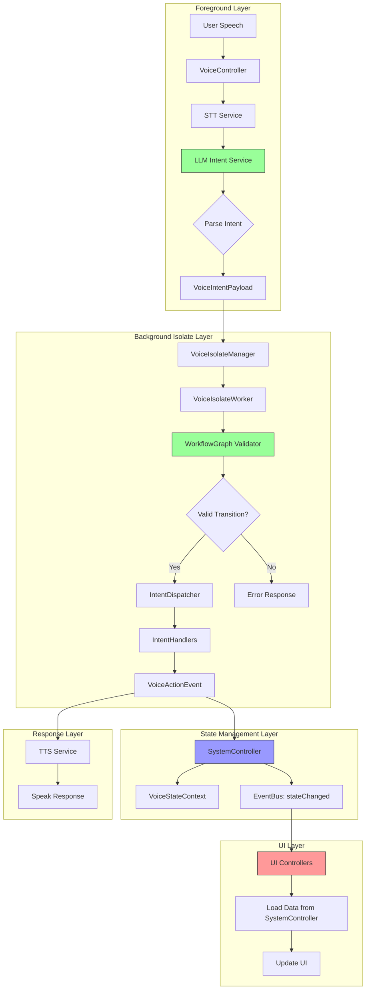

# Kế Hoạch Nâng Cấp Voice Freehand Architecture

## 1. Phân Tích Flow Hiện Tại

### 1.1. Flow Hiện Tại (Current State)



### 1.2. Các Vấn Đề Hiện Tại

#### A. Kiến Trúc Phân Tán
- **VoiceController** xử lý STT → LLM → TTS trong foreground
- **VoiceForegroundTaskHandler** duplicate logic tương tự
- **Background Isolate** (`lib/voice/core`) chưa được kết nối
- Không có single source of truth cho state

#### B. Intent Processing Không Hoàn Chỉnh
- LLM chỉ trả về text response, không parse intent
- **WorkflowGraph** đã được định nghĩa nhưng chưa được sử dụng
- **IntentDispatcher** có logic cứng (hardcoded), không dùng graph
- Không có validation state transitions

#### C. UI Event Handling Trực Tiếp
```dart
// ❌ Vấn đề: UI screens listen trực tiếp và trigger actions
_voiceActionSub = eventBus.stream
  .where((e) => e.type == AppEventType.voiceAction)
  .listen((event) {
    final action = event.payload;
    if (action.action == 'selectBook') {
      openBook(book); // Direct action
    }
  });
```

**Vấn đề:**
- UI screens phải biết cách xử lý từng action
- Không có separation of concerns
- Controllers không quản lý data flow
- Khó test và maintain

#### D. State Management Thiếu
- Không có global state tracking
- Mỗi component tự quản lý state riêng
- Không có state history hoặc undo/redo
- Không emit state changes cho debugging

#### E. Foreground ↔ Background Disconnect
```dart
// ❌ Foreground task không connect với background isolate
class VoiceForegroundTaskHandler {
  // Xử lý STT → LLM → TTS trực tiếp
  // Không gửi intent đến background isolate
}
```

---

## 2. Kiến Trúc Mới (Target Architecture)

### 2.1. Overview Diagram



### 2.2. Detailed Flow

#### Phase 1: Speech → Intent Extraction
```
User Speech 
  → STT Service (speech-to-text)
  → LLM Intent Service (với workflow graph context)
  → VoiceIntentPayload {
      intent: "selectBook",
      slots: {"bookName": "English Starter"},
      confidence: 0.95
    }
```

#### Phase 2: Intent Validation & Dispatch (Background Isolate)
```
VoiceIntentPayload
  → VoiceIsolateManager.dispatchIntent()
  → VoiceIsolateWorker
  → WorkflowGraph.validate(currentState, intent)
  → IntentDispatcher.dispatch()
  → IntentHandler.execute()
  → VoiceActionEvent {
      action: "navigateToBook",
      data: {"bookId": "book_001"}
    }
```

#### Phase 3: State Update & UI Sync
```
VoiceActionEvent
  → SystemController.handleAction()
  → Update VoiceStateContext
  → Emit AppEvent(stateChanged, newState)
  → UI Controllers listen
  → Load data from SystemController
  → Update UI
```

---

## 3. Chi Tiết Các Components Mới

### 3.1. SystemController (NEW)

**Vai trò:** Single source of truth cho application state

```dart
class SystemController extends GetxController {
  // Global state
  final voiceState = VoiceStateContext(currentScreen: 'idle').obs;
  
  // Data cache
  final currentBook = Rxn<Book>();
  final currentTopic = Rxn<Topic>();
  final currentCards = <VocabCard>[].obs;
  
  // Handle voice actions
  Future<void> handleVoiceAction(VoiceActionEvent event) async {
    switch (event.action) {
      case 'navigateToBook':
        await _loadBook(event.data['bookId']);
        voiceState.update((state) {
          state?.currentBookId = event.data['bookId'];
          state?.currentScreen = 'bookSelected';
        });
        eventBus.emit(AppEvent(AppEventType.stateChanged, voiceState.value));
        break;
      // ... other actions
    }
  }
  
  // Data loaders
  Future<void> _loadBook(String bookId) async {
    currentBook.value = await BookRepository.getById(bookId);
  }
  
  // Getters for UI
  Book? get book => currentBook.value;
  Topic? get topic => currentTopic.value;
  List<VocabCard> get cards => currentCards;
}
```

### 3.2. Enhanced LLM Intent Service

**Nhiệm vụ:** Parse user speech thành structured intent với workflow context

```dart
class LLMIntentService {
  final WorkflowGraph _graph;
  final VoiceStateContext _currentState;
  
  Future<VoiceIntentPayload> parseIntent(String userText) async {
    // Get available intents for current state
    final availableIntents = _graph.getAvailableIntents(_currentState.currentScreen);
    
    // Build prompt with context
    final prompt = '''
Current State: ${_currentState.currentScreen}
Available Actions: ${availableIntents.join(', ')}
User Said: "$userText"

Parse the user's intent and extract slots.
Return JSON: {"intent": "...", "slots": {...}, "confidence": 0.0-1.0}
''';
    
    final response = await _llm.generateResponse(prompt);
    return VoiceIntentPayload.fromJson(jsonDecode(response));
  }
}
```

### 3.3. WorkflowGraph Integration

**Sử dụng:** Validate state transitions trước khi dispatch

```dart
class IntentDispatcher {
  final WorkflowGraph _graph;
  final VoiceStateContext _state;
  
  Future<VoiceActionEvent> dispatch(VoiceIntentPayload payload) async {
    // Validate transition
    final transition = _graph.findTransition(_state.currentScreen, payload.intent);
    
    if (transition == null) {
      return VoiceActionEvent(
        action: 'invalidIntent',
        data: {'reason': 'No valid transition from ${_state.currentScreen}'},
        requiresUI: false,
      );
    }
    
    // Execute actions in sequence
    for (final actionName in transition.actions) {
      await _executeAction(actionName, payload);
    }
    
    // Update state
    _state.currentScreen = transition.target;
    
    return VoiceActionEvent(
      action: transition.actions.last,
      data: {'newState': _state.currentScreen},
      requiresUI: true,
    );
  }
}
```

### 3.4. UI Controller Pattern (NEW)

**Thay đổi:** UI controllers chỉ load data, không xử lý actions

```dart
class BooksController extends GetxController {
  final SystemController _system = Get.find<SystemController>();
  
  @override
  void onInit() {
    super.onInit();
    
    // Listen to state changes
    ever(_system.voiceState, (state) {
      if (state.currentScreen == 'bookSelected') {
        _refreshCurrentBook();
      }
    });
  }
  
  void _refreshCurrentBook() {
    // Load data from SystemController
    final book = _system.book;
    if (book != null) {
      // Update UI-specific observables
      selectedBook.value = book;
    }
  }
  
  // UI actions still work
  void selectBook(Book book) {
    // Emit intent instead of direct action
    eventBus.emit(AppEvent(
      AppEventType.voiceIntent,
      VoiceIntentPayload(
        intent: 'selectBook',
        slots: {'bookId': book.id},
        confidence: 1.0,
        timestamp: DateTime.now(),
      ),
    ));
  }
}
```

---

## 4. Event Flow Mới

### 4.1. Event Types

```dart
enum AppEventType {
  // Microphone lifecycle
  micStarted,
  micStopped,
  
  // Wakeword
  wakewordDetected,
  
  // Voice processing
  voiceIntent,      // NEW: Intent detected
  voiceAction,      // Action to execute
  
  // State management
  stateChanged,     // NEW: State updated
  stateError,       // NEW: State transition error
  
  // System
  assistantMessage,
}
```

### 4.2. State Change Events

```dart
// Emit state changes for debugging and UI sync
eventBus.emit(AppEvent(
  AppEventType.stateChanged,
  {
    'previousState': oldState.toJson(),
    'newState': newState.toJson(),
    'trigger': 'voiceIntent:selectBook',
    'timestamp': DateTime.now().toIso8601String(),
  }
));
```

---

## 5. Implementation Plan

### Phase 1: Foundation (Week 1)
- [ ] Tạo `SystemController` với basic state management
- [ ] Thêm `AppEventType.stateChanged` và `stateError`
- [ ] Refactor `VoiceStateContext` để support state history
- [ ] Tạo state persistence layer

### Phase 2: LLM Intent Integration (Week 2)
- [ ] Tạo `LLMIntentService` với workflow context
- [ ] Integrate `WorkflowGraph` vào intent parsing
- [ ] Update prompt templates với available intents
- [ ] Add confidence scoring và fallback logic

### Phase 3: Background Isolate Connection (Week 3)
- [ ] Connect `VoiceForegroundTaskHandler` với `VoiceIsolateManager`
- [ ] Implement intent dispatch từ foreground → isolate
- [ ] Setup bi-directional communication
- [ ] Add error handling và retry logic

### Phase 4: Intent Dispatcher Refactor (Week 4)
- [ ] Refactor `IntentDispatcher` để sử dụng `WorkflowGraph`
- [ ] Implement state validation trước khi dispatch
- [ ] Update `IntentHandlers` để work với `SystemController`
- [ ] Add action execution pipeline

### Phase 5: UI Controllers Update (Week 5)
- [ ] Refactor `BooksController`, `TopicController`, etc.
- [ ] Remove direct action handling từ UI screens
- [ ] Implement data loading từ `SystemController`
- [ ] Add reactive state listeners

### Phase 6: Testing & Documentation (Week 6)
- [ ] Unit tests cho `SystemController`
- [ ] Integration tests cho intent flow
- [ ] E2E tests cho voice commands
- [ ] Update documentation và diagrams

---

## 6. Migration Strategy

### 6.1. Backward Compatibility

Giữ cả hai flows trong giai đoạn chuyển đổi:

```dart
class VoiceController {
  bool _useNewArchitecture = false; // Feature flag
  
  Future<void> processIntent(VoiceIntentPayload payload) async {
    if (_useNewArchitecture) {
      // New flow: dispatch to isolate
      await VoiceIsolateManager().dispatchIntent(payload);
    } else {
      // Old flow: direct processing
      _processIntentDirectly(payload);
    }
  }
}
```

### 6.2. Gradual Rollout

1. **Week 1-2:** Implement new components, keep old flow active
2. **Week 3-4:** Enable new flow for testing users (feature flag)
3. **Week 5:** Enable for all users
4. **Week 6:** Remove old code

---

## 7. Benefits của Kiến Trúc Mới

### 7.1. Separation of Concerns
- **Foreground:** STT + LLM intent parsing
- **Background Isolate:** Intent validation + dispatch
- **SystemController:** State management
- **UI Controllers:** Data loading only

### 7.2. Testability
- Mỗi component có thể test độc lập
- Mock dependencies dễ dàng
- State transitions có thể verify

### 7.3. Maintainability
- Single source of truth cho state
- Clear data flow
- Easy to add new intents/actions

### 7.4. Scalability
- Background isolate không block UI
- State history cho undo/redo
- Easy to add new features

### 7.5. Debugging
- State changes được track
- Event flow rõ ràng
- Error handling tập trung

---

## 8. Risks & Mitigations

### Risk 1: Performance Overhead
**Mitigation:** 
- Profile isolate communication
- Optimize state serialization
- Cache frequently accessed data

### Risk 2: Complexity Increase
**Mitigation:**
- Clear documentation
- Code examples
- Developer training

### Risk 3: Migration Bugs
**Mitigation:**
- Feature flags
- Gradual rollout
- Comprehensive testing

---

## 9. Success Metrics

- [ ] All voice intents processed through new flow
- [ ] State changes tracked và logged
- [ ] UI controllers không handle actions trực tiếp
- [ ] Background isolate active và stable
- [ ] Test coverage > 80%
- [ ] Zero regression bugs

---

## 10. Next Steps

1. **Review kế hoạch này với team**
2. **Tạo detailed technical specs cho từng component**
3. **Setup development environment**
4. **Start Phase 1 implementation**
