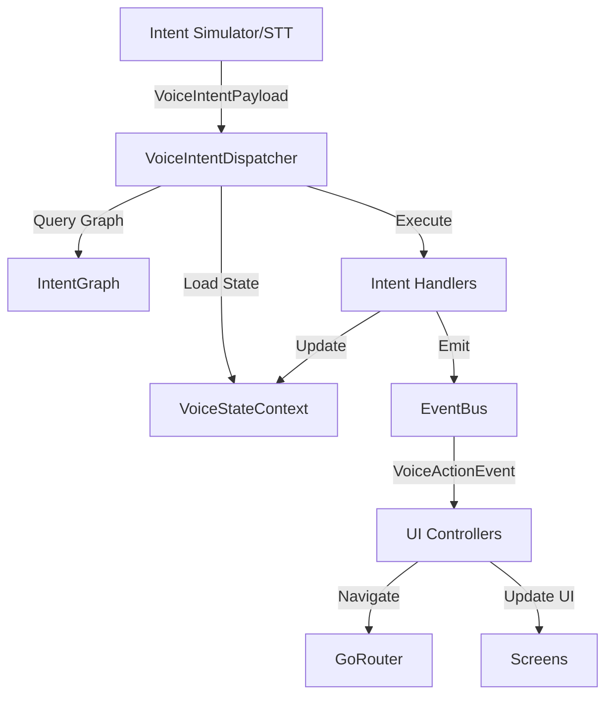

# Voice Intent System Architecture

## Overview

This document describes the architecture for the voice-driven intent system that enables hands-free navigation and interaction with the Chicki Assistant app.

## System Architecture



## Core Components

### 1. Data Models

#### VoiceIntentPayload
Represents an intent detected from user speech or simulator.

```dart
class VoiceIntentPayload {
  final String intent;              // Intent name: "selectBook", "nextVocab"
  final Map<String, dynamic> slots; // Extracted parameters
  final double confidence;          // 0.0 - 1.0
  final DateTime timestamp;
}
```

**Example:**
```json
{
  "intent": "selectBook",
  "slots": {"bookName": "English Starter"},
  "confidence": 0.92,
  "timestamp": "2025-01-16T08:00:00Z"
}
```

#### VoiceActionEvent
Represents an action to be performed by the UI.

```dart
class VoiceActionEvent {
  final String action;              // Action type: "navigateToBook"
  final Map<String, dynamic> data;  // Action parameters
  final bool requiresUI;            // Whether UI must be visible
}
```

**Example:**
```json
{
  "action": "navigateToBook",
  "data": {"bookId": "book_001"},
  "requiresUI": true
}
```

#### VoiceStateContext
Maintains the current context of the voice session.

```dart
class VoiceStateContext {
  String? currentBookId;
  String? currentTopicId;
  int? currentCardIndex;
  String? currentScreen;
  String? mode;  // "learning", "review", "idle"
  
  // Persistence
  Map<String, dynamic> toJson();
  factory VoiceStateContext.fromJson(Map<String, dynamic> json);
}
```

### 2. Intent Graph

The intent graph defines valid state transitions and actions.

**Structure:**
```json
{
  "nodes": {
    "idle": {
      "description": "Initial state, no book selected",
      "transitions": [
        {
          "intent": "selectBook",
          "condition": "slots.bookName != null",
          "target": "bookSelected",
          "actions": ["findBook", "updateBookContext", "emitNavigateToBook"]
        }
      ]
    },
    "bookSelected": {
      "description": "Book is selected, can navigate topics",
      "transitions": [
        {
          "intent": "selectTopic",
          "condition": "slots.topicName != null",
          "target": "topicSelected",
          "actions": ["findTopic", "updateTopicContext", "emitNavigateToTopic"]
        },
        {
          "intent": "listTopics",
          "target": "bookSelected",
          "actions": ["emitShowTopicList"]
        }
      ]
    },
    "topicSelected": {
      "description": "Topic selected, can navigate cards",
      "transitions": [
        {
          "intent": "nextVocab",
          "target": "vocabCard",
          "actions": ["incrementCardIndex", "emitShowCard"]
        },
        {
          "intent": "previousVocab",
          "target": "vocabCard",
          "actions": ["decrementCardIndex", "emitShowCard"]
        },
        {
          "intent": "readAloud",
          "target": "topicSelected",
          "actions": ["speakCurrentCard"]
        }
      ]
    },
    "vocabCard": {
      "description": "Viewing a vocabulary card",
      "transitions": [
        {
          "intent": "nextVocab",
          "target": "vocabCard",
          "actions": ["incrementCardIndex", "emitShowCard"]
        },
        {
          "intent": "previousVocab",
          "target": "vocabCard",
          "actions": ["decrementCardIndex", "emitShowCard"]
        },
        {
          "intent": "readAloud",
          "target": "vocabCard",
          "actions": ["speakCurrentCard"]
        },
        {
          "intent": "backToTopic",
          "target": "topicSelected",
          "actions": ["emitNavigateToTopic"]
        }
      ]
    }
  }
}
```

### 3. VoiceIntentDispatcher

The dispatcher is the core engine that processes intents.

**Responsibilities:**
1. Receive VoiceIntentPayload
2. Load current VoiceStateContext
3. Query IntentGraph for valid transitions
4. Execute intent handlers
5. Update VoiceStateContext
6. Emit VoiceActionEvent to UI

**Flow:**
```dart
Future<void> dispatch(VoiceIntentPayload payload) async {
  // 1. Load current state
  final state = await _stateController.getState();
  
  // 2. Find transition
  final transition = _graph.findTransition(
    currentNode: state.currentScreen ?? 'idle',
    intent: payload.intent,
  );
  
  if (transition == null) {
    _handleUnknownIntent(payload);
    return;
  }
  
  // 3. Check condition
  if (!_evaluateCondition(transition.condition, payload, state)) {
    _handleFailedCondition(transition, payload);
    return;
  }
  
  // 4. Execute actions
  for (final actionName in transition.actions) {
    final handler = _handlers[actionName];
    await handler?.execute(payload, state);
  }
  
  // 5. Update state
  state.currentScreen = transition.target;
  await _stateController.saveState(state);
  
  // 6. Log session
  await _sessionLogger.log(payload, transition, state);
}
```

### 4. Intent Handlers

Handlers are modular action executors.

**Base Interface:**
```dart
abstract class IntentHandler {
  String get name;
  Future<HandlerResult> execute(
    VoiceIntentPayload payload,
    VoiceStateContext state,
  );
}

class HandlerResult {
  final bool success;
  final Map<String, dynamic> data;
  final String? error;
}
```

**Example Handler:**
```dart
class SelectBookHandler extends IntentHandler {
  final BookService _bookService;
  
  @override
  String get name => 'findBook';
  
  @override
  Future<HandlerResult> execute(
    VoiceIntentPayload payload,
    VoiceStateContext state,
  ) async {
    final bookName = payload.slots['bookName'] as String?;
    if (bookName == null) {
      return HandlerResult(success: false, error: 'Missing bookName');
    }
    
    // Find book by name
    final books = await _bookService.loadAllBooks();
    final book = books.firstWhere(
      (b) => b.title.toLowerCase().contains(bookName.toLowerCase()),
      orElse: () => null,
    );
    
    if (book == null) {
      return HandlerResult(success: false, error: 'Book not found');
    }
    
    // Update state
    state.currentBookId = book.id;
    
    // Emit navigation event
    eventBus.emit(AppEvent(
      AppEventType.voiceAction,
      VoiceActionEvent(
        action: 'navigateToBook',
        data: {'bookId': book.id},
        requiresUI: true,
      ),
    ));
    
    return HandlerResult(success: true, data: {'bookId': book.id});
  }
}
```

### 5. Intent Simulator

For testing without STT integration.

```dart
class IntentSimulator {
  final VoiceIntentDispatcher _dispatcher;
  
  void emitSelectBook(String bookName) {
    _dispatcher.dispatch(VoiceIntentPayload(
      intent: 'selectBook',
      slots: {'bookName': bookName},
      confidence: 1.0,
      timestamp: DateTime.now(),
    ));
  }
  
  void emitNextVocab() {
    _dispatcher.dispatch(VoiceIntentPayload(
      intent: 'nextVocab',
      slots: {},
      confidence: 1.0,
      timestamp: DateTime.now(),
    ));
  }
  
  // ... more helper methods
}
```

## File Structure

```
lib/
├── voice/
│   ├── models/
│   │   ├── voice_intent_payload.dart
│   │   ├── voice_action_event.dart
│   │   └── voice_state_context.dart
│   ├── dispatcher/
│   │   ├── voice_intent_dispatcher.dart
│   │   └── intent_graph.dart
│   ├── handlers/
│   │   ├── intent_handler.dart
│   │   ├── select_book_handler.dart
│   │   ├── select_topic_handler.dart
│   │   ├── next_vocab_handler.dart
│   │   ├── previous_vocab_handler.dart
│   │   └── read_aloud_handler.dart
│   └── simulator/
│       └── intent_simulator.dart
├── core/
│   └── app_event_bus.dart  # Enhanced
└── ui/
    └── screens/
        └── intent_test_screen.dart
```

## Integration with Existing Code

### 1. EventBus Enhancement

Add new event types to [`app_event_bus.dart`](lib/core/app_event_bus.dart):

```dart
enum AppEventType {
  wakewordDetected,
  assistantMessage,
  micStarted,
  micStopped,
  voiceIntent,      // NEW: Intent detected
  voiceAction,      // NEW: Action to perform
}
```

### 2. VoiceController Integration

After STT completes, emit intent:

```dart
// In voice_controller.dart
_sttService.onTextRecognized.listen((text) async {
  // Classify intent (using existing classifier or pattern matching)
  final intent = await _classifyIntent(text);
  
  // Emit to dispatcher
  eventBus.emit(AppEvent(
    AppEventType.voiceIntent,
    VoiceIntentPayload(
      intent: intent.name,
      slots: intent.slots,
      confidence: intent.confidence,
      timestamp: DateTime.now(),
    ),
  ));
});
```

### 3. UI Controllers

Subscribe to voice actions:

```dart
// In books_controller.dart
@override
void onInit() {
  super.onInit();
  
  _voiceActionSub = eventBus.stream
    .where((e) => e.type == AppEventType.voiceAction)
    .listen((event) {
      final action = event.payload as VoiceActionEvent;
      _handleVoiceAction(action);
    });
}

void _handleVoiceAction(VoiceActionEvent action) {
  switch (action.action) {
    case 'navigateToBook':
      final bookId = action.data['bookId'];
      Get.toNamed('/books/$bookId');
      break;
    case 'showTopicList':
      // Update UI to show topics
      break;
  }
}
```

## Testing Strategy

### Phase 1: Simulator Testing
1. Create test screen with buttons
2. Each button emits a specific intent
3. Verify state transitions
4. Verify UI navigation

### Phase 2: Integration Testing
1. Connect to STT output
2. Test with real voice commands
3. Verify end-to-end flow

### Phase 3: Edge Cases
1. Unknown intents
2. Missing slots
3. Invalid state transitions
4. UI not visible scenarios

## Future Enhancements

1. **Hive Persistence**: Save VoiceStateContext to Hive for restore
2. **Session Logging**: Track all intents and actions for analytics
3. **Ambiguity Resolution**: Handle unclear intents with clarification
4. **Background Mode**: Process intents when UI is not visible
5. **TTS Integration**: Speak confirmations and clarifications
6. **Native NNAPI**: Optimize intent classification with native models

## Example Usage Scenarios

### Scenario 1: Select Book and Navigate
```
User: "Open English Starter book"
→ Intent: selectBook, slots: {bookName: "English Starter"}
→ Handler: FindBook → UpdateState → EmitNavigateToBook
→ UI: Navigate to /books/book_001
```

### Scenario 2: Navigate Vocabulary Cards
```
User: "Next word"
→ Intent: nextVocab
→ Handler: IncrementCardIndex → EmitShowCard
→ UI: Show card at index 5
```

### Scenario 3: Read Aloud
```
User: "Read this word"
→ Intent: readAloud
→ Handler: SpeakCurrentCard
→ TTS: Speaks current vocabulary word
```

## References

- Current VoiceController: [`lib/controllers/voice_controller.dart`](lib/controllers/voice_controller.dart)
- EventBus: [`lib/core/app_event_bus.dart`](lib/core/app_event_bus.dart)
- Book Models: [`lib/models/book.dart`](lib/models/book.dart)
- Existing Classifier: [`lib/services/native_classifier.service.dart`](lib/services/native_classifier.service.dart)